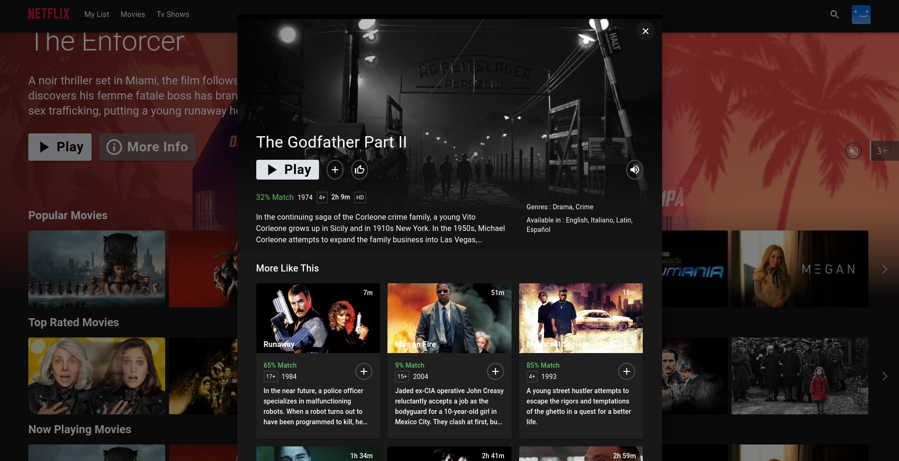
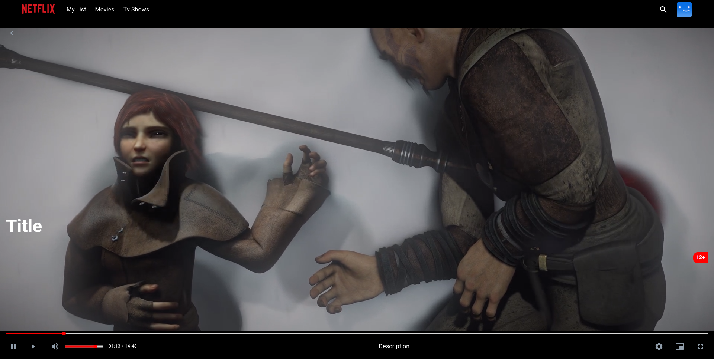

  
  </img>

  <h3 align="center">Netflix Clone</h3>

  

    <a href="https://ahmedkhalid90h.github.io/palestine_movie_app/">View Demo</a>
    ·
    
  

 

  
  
Home Page

  
  
Mini Portal

  
  
Detail Modal

  
  
Grid Genre Page

  
  
Watch Page with customer contol bar

 

## Which features this project deal with

- How to create and use [Custom Hooks](https://reactjs.org/docs/hooks-custom.html)
- How to use [Context](https://reactjs.org/docs/context.html) and its provider
- How to use lazy and Suspense for [Code-Splitting](https://reactjs.org/docs/code-splitting.html)
- How to use a new [lazy](https://reactrouter.com/en/main/route/lazy) feature of react-router to reduce bundle size.
- How to use data [loader](https://reactrouter.com/en/main/route/loader) of react-router, and how to use redux dispatch in the loader to fetch data before rendering component.
- How to use [Portal](https://reactjs.org/docs/portals.html)
- How to use [Fowarding Refs](https://reactjs.org/docs/forwarding-refs.html) to make components reusuable
- How to create and use [HOC](https://reactjs.org/docs/higher-order-components.html)
- How to customize default theme of [MUI](https://mui.com/)
- How to use [RTK](https://redux-toolkit.js.org/introduction/getting-started)
- How to use [RTK Query](https://redux-toolkit.js.org/rtk-query/overview)
- How to customize default classname of [MUI](https://mui.com/material-ui/experimental-api/classname-generator)
- Infinite Scrolling(using [Intersection Observer API](https://developer.mozilla.org/en-US/docs/Web/API/Intersection_Observer_API))
- How to make awesome carousel using [slick-carousel](https://react-slick.neostack.com)

 

## ✹ Link to the Project ✹
* [Todo list React App](https://ahmedkhalid90h.github.io/React_TO_DO_List_Project/) 

Known Issues
---
To report issues, please email me at ahmedkhalid90h@gmail.com.

 

# Getting Started with Create React App

This project was bootstrapped with [Create React App](https://github.com/facebook/create-react-app).

## Available Scripts

In the project directory, you can run:

### `npm start`

Runs the app in the development mode.\
Open [http://localhost:3000](http://localhost:3000) to view it in your browser.

The page will reload when you make changes.\
You may also see any lint errors in the console.

### `npm test`

Launches the test runner in the interactive watch mode.\
See the section about [running tests](https://facebook.github.io/create-react-app/docs/running-tests) for more information.

### `npm run build`

Builds the app for production to the `build` folder.\
It correctly bundles React in production mode and optimizes the build for the best performance.

The build is minified and the filenames include the hashes.\
Your app is ready to be deployed!

See the section about [deployment](https://facebook.github.io/create-react-app/docs/deployment) for more information.

### `npm run eject`

**Note: this is a one-way operation. Once you `eject`, you can't go back!**

If you aren't satisfied with the build tool and configuration choices, you can `eject` at any time. This command will remove the single build dependency from your project.

Instead, it will copy all the configuration files and the transitive dependencies (webpack, Babel, ESLint, etc) right into your project so you have full control over them. All of the commands except `eject` will still work, but they will point to the copied scripts so you can tweak them. At this point you're on your own.

You don't have to ever use `eject`. The curated feature set is suitable for small and middle deployments, and you shouldn't feel obligated to use this feature. However we understand that this tool wouldn't be useful if you couldn't customize it when you are ready for it.

## Learn More

You can learn more in the [Create React App documentation](https://facebook.github.io/create-react-app/docs/getting-started).

To learn React, check out the [React documentation](https://reactjs.org/).

### Code Splitting

This section has moved here: [https://facebook.github.io/create-react-app/docs/code-splitting](https://facebook.github.io/create-react-app/docs/code-splitting)

### Analyzing the Bundle Size

This section has moved here: [https://facebook.github.io/create-react-app/docs/analyzing-the-bundle-size](https://facebook.github.io/create-react-app/docs/analyzing-the-bundle-size)

### Making a Progressive Web App

This section has moved here: [https://facebook.github.io/create-react-app/docs/making-a-progressive-web-app](https://facebook.github.io/create-react-app/docs/making-a-progressive-web-app)

### Advanced Configuration

This section has moved here: [https://facebook.github.io/create-react-app/docs/advanced-configuration](https://facebook.github.io/create-react-app/docs/advanced-configuration)

### Deployment

This section has moved here: [https://facebook.github.io/create-react-app/docs/deployment](https://facebook.github.io/create-react-app/docs/deployment)

### `npm run build` fails to minify

This section has moved here: [https://facebook.github.io/create-react-app/docs/troubleshooting#npm-run-build-fails-to-minify](https://facebook.github.io/create-react-app/docs/troubleshooting#npm-run-build-fails-to-minify)

## ✹ Link to the Project ✹
* [Todo list React App](https://ahmedkhalid90h.github.io/React_TO_DO_List_Project/) 

Known Issues
---
To report issues, please email me at ahmedkhalid90h@gmail.com.
